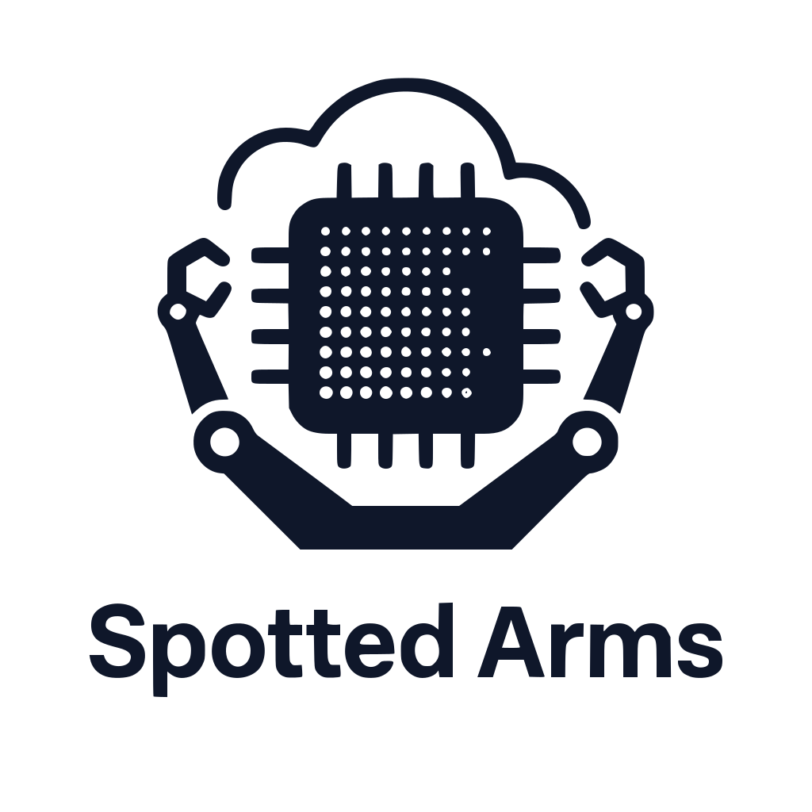

# Spotted Arms

<p align="center">
  
</p>

Spotted Arms is a small Rust service that listens for GitHub `workflow_job` webhooks and provisions ephemeral self‑hosted runners on Google Compute Engine using a region instance template. When jobs complete, the service deletes the instance.

## Features
- Axum HTTP server with webhook verification
- JIT runner configuration via GitHub API
- GCE instance create/delete from a region instance template
- Deterministic zone selection within a region
- Structured JSON logging and OpenTelemetry (Cloud Trace) export
- Health and ping endpoints

## Endpoints
- `POST /webhook` — GitHub webhook receiver for `workflow_job` events
- `GET /ping` — simple liveness probe (returns `pong`)
- `POST /health_check` — returns JSON status and request headers

## Requirements
- Rust toolchain (1.75+ recommended)
- A Google Cloud project and service account with permissions:
  - `compute.instances.insert`
  - `compute.instances.delete`
  - `compute.regionInstanceTemplates.get`
- A pre‑created GCE region instance template for your runner image
- A GitHub App or token able to call the JIT config endpoint with repository admin permissions for Actions runners (or equivalent)

## Configuration
This service intentionally avoids baked‑in defaults. Configure it via CLI flags or the corresponding environment variables; when omitted, some values can be discovered from GCP metadata.

### Required
- `PORT` / `--port` — TCP port for the HTTP server. Defaults to `3000` if unset.
- `GITHUB_CREDENTIALS` / `--github-credentials` — JSON with your GitHub token and webhook secret, for example:

  ```json
  { "token": "ghp_xxx", "secret": "webhook-shared-secret" }
  ```

- `INSTANCE_TEMPLATE` / `--instance-template` — Name of the GCE region instance template to use.

### Project/Location
- Project ID: `--project-id` (preferred) or `GOOGLE_CLOUD_PROJECT`/`GCP_PROJECT`, or discoverable via the GCE metadata server.
- Zone/Region:
  - Zone: `--zone` or `GOOGLE_CLOUD_ZONE` (e.g., `us-central1-f`).
  - Region is derived from the zone suffix (e.g., `us-central1`).

### Telemetry
- `--telemetry-project-id` / `PROJECT_ID` — Used by the Cloud Trace exporter; otherwise falls back to GCP metadata discovery.

### Precedence
- CLI flags override environment variables.
- If neither flag nor env is set:
  - Project ID and zone are discovered via the GCP metadata server (on GCE).
  - Region is derived from the zone (e.g., `us-central1-f` → `us-central1`).
  - Port defaults to `3000`.

### GitHub filtering
- Jobs must include all required labels to be processed: `linux`, `self-hosted`, `ARM64`.

### Region support
- Currently, instance creation only supports the `us-central1` region. If your zone/region differs, the request is rejected. Zone within the region is selected deterministically per instance.

## Running locally
1. Configure the required values (via flags or env). Examples:

   Using environment variables (you can omit `PORT` to use `3000`):

   ```bash
   # export PORT=3000
   export INSTANCE_TEMPLATE=c4a-standard-1   # example
   export GITHUB_CREDENTIALS='{"token":"<token>","secret":"<secret>"}'
   export GOOGLE_CLOUD_PROJECT=<project>      # or ensure metadata is available
   export GOOGLE_CLOUD_ZONE=us-central1-f
   ```

   Or using CLI flags:

   ```bash
   cargo run --bin spotted-arms -- \
     --github-credentials '{"token":"<token>","secret":"<secret>"}' \
     --instance-template c4a-standard-1 \
     --project-id <project> \
     --zone us-central1-f
   ```

2. Build and run:

   ```bash
   cargo run --bin spotted-arms -- --help
   # or specify a port via CLI or env
   cargo run --bin spotted-arms -- --port 8080
   PORT=9090 cargo run --bin spotted-arms
   ```

3. Send a test webhook payload (ensure the signature/secret matches) to `http://localhost:3000/webhook`.

## Deploying
- Run as a service on GCE/GKE/Cloud Run with the above environment.
- Ensure the service account has the Compute and Trace permissions listed.
- Configure your GitHub App webhook to point at `https://<your-host>/webhook` and set the same shared secret used in `GITHUB_CREDENTIALS`.

## How it works
- Webhook handler validates the request and inspects `workflow_job` events.
- If labels match, it derives an instance name and requests:
  - GitHub JIT config for the runner name
  - Region instance template metadata from GCE
- It injects the JIT config as instance metadata and calls `instances.insert`.
- On `workflow_job.completed`, it computes the same zone and calls `instances.delete`.

## Troubleshooting
- `PORT` not set → server listens on `3000` by default.
- Missing `GITHUB_CREDENTIALS` or malformed JSON → startup error.
- Missing `INSTANCE_TEMPLATE` → startup error.
- Unable to determine project/zone → metadata discovery fails; provide `--project-id` and `--zone`.
- Region not `us-central1` → request rejected; set a `us-central1-*` zone.

## Development
- Build: `cargo build`
- Check: `cargo check`
- Test: `cargo test`

## CLI usage
- `--help` shows usage and options.
- Options mirror env vars and accept Unicode descriptions.

Available flags
- `-p, --port` (env: `PORT`) — 🚪 HTTP server port. Default: `3000`.
- `--github-credentials` (env: `GITHUB_CREDENTIALS`) — 🔑 GitHub credentials JSON: {"token":"...","secret":"..."}.
- `--instance-template` (env: `INSTANCE_TEMPLATE`) — 🧩 GCE region instance template name.
- `--project-id` (env: `GOOGLE_CLOUD_PROJECT`) — 🏷️ Google Cloud project ID. Also sets `GCP_PROJECT` for compatibility.
- `--zone` (env: `GOOGLE_CLOUD_ZONE`) — 📍 Google Cloud zone (e.g., `us-central1-f`).
- `--telemetry-project-id` (env: `PROJECT_ID`) — 📊 Cloud Trace project override.

Contributions and improvements welcome!
